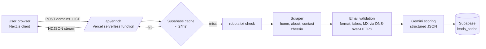

# LeadLens — AI Lead Qualifier for SaaSquatch

> Paste company websites → define your Ideal Customer Profile → get enriched, validated and AI-ranked leads ready for outreach and CRM import.

**Live demo:** https://ai-lead-qualifier-for-saa-squatch.vercel.app
**Video walkthrough:** https://drive.google.com/file/d/1-55tsqOJ4t7yv_EdzF2VdMZpKPAYjpKq/view?usp=sharing

---

## 1. The problem

[SaaSquatch](https://www.saasquatchleads.com/) is great at **finding** companies. The next bottleneck for a sales team is **deciding who to call first**:

- Raw lead lists contain duplicates, dead domains and placeholder emails.
- Reps waste time on companies that don't match what they sell.
- Every lead still needs a personalised opener before it goes into the CRM.

## 2. The solution

LeadLens is a lightweight qualification layer that sits right after lead discovery:

| Step | What happens |
|---|---|
| **1. Add companies** | Paste URLs or upload a CSV. URLs are normalised (`https://www.Acme.com/about` → `acme.com`) and duplicates are removed before any network call. |
| **2. Define ICP** | Target industry, location, B2B/B2C and a one-line "what I sell". |
| **3. Qualify** | Each site is scraped (home, /about, /contact), emails are validated, and Gemini scores the company 0-100 against the ICP with a reason and a personalised outreach opener. Results stream in live. |
| **4. Act** | Filter by fit, search, sort by score, open a lead for full detail, then export to CSV or a **HubSpot-ready import file**. |

### Why this feature (Quality-first approach)
I chose to build one high-impact feature end-to-end rather than many shallow ones. Lead **prioritisation** has the most direct effect on revenue: it reduces time spent on bad-fit leads and makes every exported lead actionable (verified email + reason + opener).

## 3. Features

- **Smart input**: textarea or CSV upload (auto-detects `domain` / `website` / `url` column), URL normalisation, de-duplication, invalid-entry detection, sample list for demos.
- **Ethical scraping**: respects `robots.txt` (Allow/Disallow, longest-match rule), identifies itself with a clear User-Agent, 8s timeout + 1 retry, max 4 sites in parallel, public business pages only.
- **Enrichment**: company name, description, emails, phone numbers, LinkedIn / X / Facebook links, contact page, country hint.
- **Email validation**: format check, placeholder/tracking filter (`example.com`, `sentry.io`, `wixpress.com`…), MX record lookup, generic (`info@`, `sales@`) vs personal classification.
- **AI scoring (Gemini, structured JSON output)**: `score`, `fit`, `reason`, `industry`, `outreach_line`. Falls back to a transparent **rule-based scorer** if the AI is unavailable, so the tool never returns empty results.
- **Live progress**: results stream to the UI as NDJSON, row by row.
- **Results workspace**: summary cards, search, fit filter, "has verified email" filter, sort by score, detail drawer, copy-to-clipboard opener.
- **Exports**: full CSV and **HubSpot import format** (`Company name, Website URL, Email, Phone Number, Industry, Lead Score, Notes`).
- **24-hour cache** in Supabase: re-running a list is near-instant and avoids hitting the same websites repeatedly.
- **Dark / light mode**, responsive layout.

## 4. Architecture



**Request flow:** the client sends up to 25 domains plus the ICP. The API de-duplicates, then processes domains with a semaphore (max 4 concurrent). Each domain goes cache → robots.txt → scrape → validate → score → cache write, and the finished lead is streamed back immediately as one NDJSON line. A failure on one site is reported on that row only; the rest continue.

## 5. Tech stack and why

| Layer | Choice | Why |
|---|---|---|
| Framework | **Next.js 16 (App Router) + TypeScript** | One codebase for UI and API routes, type safety end to end |
| Styling | **Tailwind CSS v4**, lucide-react icons | Fast, consistent, themeable UI |
| Scraping | **fetch + cheerio** | Lightweight HTML parsing that runs inside a serverless function (no headless browser cold starts) |
| AI | **Google Gemini (`gemini-3.5-flash-lite`)** with `responseSchema` | Fast, low cost, guaranteed JSON shape for reliable parsing |
| Database / cache | **Supabase PostgreSQL** (`leads_cache`, JSONB) | Managed Postgres, unique index on domain for upserts, TTL queries via indexed `scraped_at` |
| Email MX check | **DNS-over-HTTPS (dns.google)** | Works in serverless environments |
| CSV | **PapaParse** | Robust CSV import/export |
| Hosting | **Vercel** (static UI + serverless API functions) | Zero-config deploys from GitHub, global CDN for the static shell |

## 6. Data storage and caching strategy

- Table `leads_cache(domain UNIQUE, scraped_data JSONB, scraped_at TIMESTAMPTZ)` — see `supabase/migration.sql`.
- Lookups use `domain` + `scraped_at >= now() - 24h`; writes are upserts on `domain`.
- Row Level Security is enabled with **no public policies**; only the server (service role key) can read or write. Keys never reach the browser.
- If Supabase is not configured, the app still works (caching is simply skipped).

## 7. Performance and reliability

- Concurrency limit of 4 balances speed with politeness to target sites.
- Per-request timeouts and one retry; robots.txt is fetched once per domain.
- Streaming means users see the first results in seconds instead of waiting for the whole batch.
- AI failures degrade gracefully to rule-based scoring (labelled "Rule-based" in the UI).

## 8. Running locally

```bash
git clone <your-repo-url>
cd leadlens
npm install
cp .env.example .env.local   # then fill in the keys
npm run dev                  # http://localhost:3000
```

### Environment variables

| Variable | Required | Description |
|---|---|---|
| `GEMINI_API_KEY` | Yes (for AI scoring) | From https://aistudio.google.com/app/apikey |
| `GEMINI_MODEL` | No | Defaults to `gemini-3.5-flash-lite` (use `gemini-3.8-flash` for higher-quality reasoning) |
| `NEXT_PUBLIC_SUPABASE_URL` | No | Supabase project URL (enables caching) |
| `SUPABASE_SERVICE_ROLE_KEY` | No | Server-only key for the cache table |

### Supabase setup
1. Create a project at https://supabase.com.
2. Open **SQL Editor** and run `supabase/migration.sql`.
3. Copy the project URL and service role key into `.env.local`.

## 9. Deployment (Vercel)

1. Push the repo to GitHub.
2. In Vercel: **Add New → Project → Import** the repo (framework auto-detected).
3. Add the environment variables above.
4. Deploy. The API route runs as a serverless function (`maxDuration = 60s`).

## 10. Ethical data collection

- Only public business pages are fetched (home, about, contact).
- `robots.txt` is always respected; blocked sites are shown as "blocked" instead of being scraped.
- Requests are rate-limited and identify the tool via User-Agent.
- No personal data is stored beyond what a company publishes for business contact, and cached data expires after 24 hours.

## 11. Future improvements

- Direct HubSpot / Salesforce push via OAuth instead of CSV.
- Headless-browser fallback for JavaScript-only websites.
- Background job queue for 1,000+ lead batches.
- Learning from won/lost deals to tune the scoring weights per customer.
- Tech-stack and hiring-signal enrichment (e.g. "hiring SDRs" = buying intent).

---

Built by **Thendralarasu S** · [GitHub](https://github.com/thendralarasu2021) · [Portfolio](https://thendralarasu-portfolio.vercel.app)
